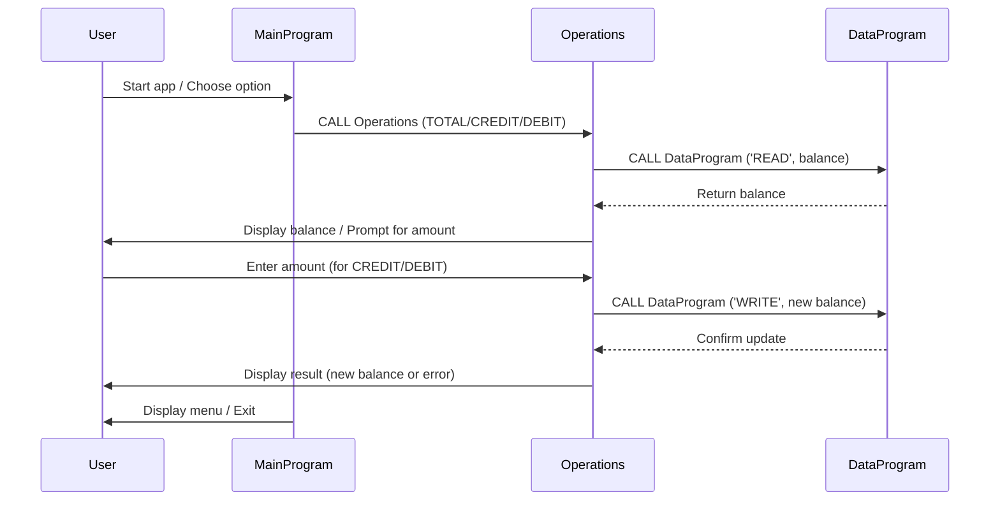

# COBOL Student Account Management System

## Overview
This project implements a simple student account management system using COBOL. It allows users to view their account balance, credit (add funds), debit (withdraw funds), and exit the program. The system is structured into three main COBOL files, each with a distinct purpose.

## File Purposes

### src/cobol/main.cob
- **Purpose:** Entry point for the application. Handles user interaction and menu navigation.
- **Key Functions:**
  - Displays the main menu and prompts the user for input.
  - Accepts user choices (view balance, credit, debit, exit).
  - Calls the `Operations` program with the selected operation type.
- **Business Rules:**
  - Only allows choices 1-4. Invalid choices prompt an error message.
  - Exits the loop and program when the user selects option 4.

### src/cobol/operations.cob
- **Purpose:** Processes account operations based on user input.
- **Key Functions:**
  - Handles 'TOTAL ' (view balance), 'CREDIT' (add funds), and 'DEBIT ' (withdraw funds) operations.
  - Calls the `DataProgram` to read or update the account balance.
  - For credit, prompts for an amount, adds it to the balance, and updates storage.
  - For debit, prompts for an amount, checks for sufficient funds, subtracts it from the balance, and updates storage.
- **Business Rules:**
  - Debit operation checks for sufficient funds before allowing withdrawal.
  - Credit and debit amounts are accepted from the user and validated against the balance.

### src/cobol/data.cob
- **Purpose:** Manages persistent storage of the account balance.
- **Key Functions:**
  - Stores the balance in working storage.
  - Handles 'READ' (retrieve balance) and 'WRITE' (update balance) operations.
  - Moves data between storage and linkage section based on operation type.
- **Business Rules:**
  - Initial balance is set to 1000.00.
  - Only 'READ' and 'WRITE' operations are supported for balance management.

## Business Rules Summary
- **Initial Balance:** Student accounts start with a balance of 1000.00.
- **View Balance:** Users can view their current balance at any time.
- **Credit Account:** Users can add funds to their account. The credited amount is added to the current balance.
- **Debit Account:** Users can withdraw funds if sufficient balance is available. If not, an error message is displayed.
- **Exit:** Users can exit the program at any time.

## Usage
Run the `MainProgram` to start the application. Follow the menu prompts to manage the student account.

---

---

## Sequence Diagram: Data Flow

Below is a Mermaid sequence diagram illustrating the data flow between the user, MainProgram, Operations, and DataProgram:

